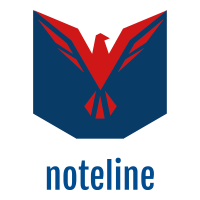

# Problem Statement
Notebook Streamlined (noteline) seeks to solve the following problem:

    On average, it takes weeks for a fully functional notebook to reach production.

Such long time delays by itself, causing many consequences. Such consequences are:
    
* Many Notebooks that are providing value never attaining to the production state
* Logic from the Notebooks that do reach the production end up been re-written from the ground up to fit into the pre-existing production infrastructure
* It is almost impossible to execute Notebooks as a pipeline step

# noteline as the Solution

**noteline** aims to solve the main problem and reduce the amount of time required to deploy artifacts generated by Notebooks into production. To achieve this, we are planning to create the following components:

* [noteline-schema](https://github.com/noteline-org/noteline-schema) - a project that defines how all the metadata stored in Notebooks
* [noteline-sdk-core](https://github.com/noteline-org/noteline-sdk-core) - core noteline SDK for manipulating the Notebooks metadata
* noteline-sdk-gcp - SDK for doing different operations with the fully reproducible Notebooks on GCP
* noteline-cli-gcp - CLI for executing different actions with Notebooks on GCP
* noteline-kf - Notebook as a step in Kubeflow Pipeline
* noteline-examples - collections of different reference architectures of building different pipelines

# Key Principles

Two main principles distinguish noteline among other projects that are aiming to solve the same or similar problem:

* We are using UODP during the implementation of the noteline
* noteline have "low bar, high ceiling."

"low bar, high ceiling." principle means that if you are starting building new infrastructure, noteline will have a set of opinionated pre-configured ways to bootstrap a new Pipeline for you. At the same time, if you already have implemented infrastructure, you can pick any noteline sub-modules and use only them. In many cases, you will be able to keep your current infrastructure and build your pipeline with minimum changes.

# Alternative Solutions

Several pre-existing solutions are focusing on solving a similar (or very close) problems. Apart from the solutions that are aiming to solve the same problem ("it takes weeks for a fully functional notebook to reach production"), we also have evaluated solutions that solving specific sub-problems:

* non-reproducibility of Notebooks outside of the original environment
* inability to deploy inference logic directly from the Notebook
* inability to execute Notebooks in the background

There is a solution that exists for each of the problems from the list. However, no one system connects all the answers in one simple-to-use system. Some evaluated solutions do provide reach and connected ecosystem; however, at the same time, they are very opinionated and therefore requiring to redesign infrastructure around them.

# Existing Solutions

## Hosted

* GCP Cloud AI Platform
* Azure
* SageMaker
* DeepNote
* PaperSpace
* DataBrick
* Netflix stack: PolyNote/Papermill
